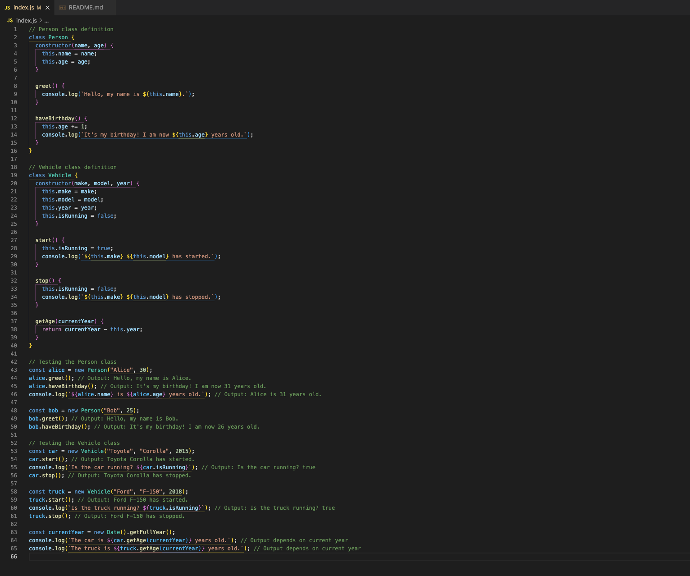

# Introduction to JavaScript Classes



---

## Description 📄

In this lab, you’ll explore **JavaScript classes** and learn how they can be used to represent real-world entities and their behaviors. **Classes** are templates that allow you to create objects with pre-defined properties and methods, making it easier to structure and organize code, especially in object-oriented programming.

This lab introduces two custom JavaScript classes:
- **Person**: Represents a person with properties like `name` and `age`, as well as methods to greet and update the person's age.
- **Vehicle**: Models a vehicle with attributes such as `make`, `model`, `year`, and a `start` or `stop` state.

By the end of this lab, you will:
- Understand how to define classes and constructors in JavaScript.
- Be able to create instances of classes and call their methods to see different behaviors.
- Learn how to modify and retrieve an object's properties.

This foundational lab will help you build a strong base for creating more complex, interactive applications in JavaScript that rely on organized, reusable code structures.

## Expected Project Structure 🏗️
Your project should be structured as follows:

```plaintext
javascript-classes/
├── index.js
└── README.md
```

##

## Instructions ✅

### 1. **Create the Project Folder and Files**
   - [ ] Create a project folder named `javascript-classes` to store your project files.

   - [ ] Inside the `javascript-classes` folder, create a file named `index.js`. This will be your main JavaScript file where all your code will be written.

##

### 2. **Build Out Your Person Class**

In this step, you will create a `Person` class to model a person with specific attributes and behaviors. The `Person` class will have properties to store a person’s `name` and `age`, and methods to enable each `Person` instance to introduce itself and celebrate its birthday. Later, you’ll call this class to create and log different `Person` objects with unique names and ages, demonstrating how the class can be reused to represent various individuals.

- [ ] Add the following code to your `index.js` file:

```javascript
// Person class definition
class Person {
  constructor(name, age) {
    this.name = name;
    this.age = age;
  }

  greet() {
    console.log(`Hello, my name is ${this.name} and I am ${this.age} years old.`);
  }

  haveBirthday() {
    this.age += 1;
    console.log(`It's my birthday! I am now ${this.age} years old.`);
  }
}
```

**Explanation:**

- **Creating the Class Structure:** The `Person` class serves as a template for creating objects that share common properties (`name` and `age`) and methods (`greet` and `haveBirthday`). This is an example of **object-oriented programming (OOP)** in JavaScript, where classes help define and organize code based on real-world objects.

- **Constructor Function:** The `constructor(name, age)` is a special function that runs automatically when a new `Person` instance is created. It sets up the `name` and `age` properties based on provided arguments, initializing each `Person` object with specific values.

- **`greet` Method:** The `greet` method logs a personalized greeting that includes the `name` property. By using **template literals** (`${}` syntax), the greeting can dynamically include the person’s name, making each `Person` instance able to introduce itself.

- **`haveBirthday` Method:** The `haveBirthday` method increases the `age` by one each time it’s called, simulating a birthday. It also logs a celebratory message with the updated age, showcasing how classes can change an object’s properties over time.

- **Calling the Class Later:** After defining the class, we’ll use it to create different `Person` instances and log various values to the console. Each instance will store a unique `name` and `age`, showing how this class can represent multiple people with distinct attributes and behaviors.


##

### 3. **Build Out Your Vehicle Class**

In this step, you’ll create a `Vehicle` class that models a vehicle with properties for `make`, `model`, `year`, and a state to track if the vehicle is running. The `Vehicle` class will include methods to start and stop the vehicle and calculate its age. Later, you’ll use this class to create and log multiple `Vehicle` objects with unique details.

- [ ] Add the following code to your `index.js` file:

```javascript
// Vehicle class definition
class Vehicle {
  constructor(make, model, year) {
    this.make = make;
    this.model = model;
    this.year = year;
    this.isRunning = false;
  }

  start() {
    this.isRunning = true;
    console.log(`${this.make} ${this.model} has started.`);
  }

  stop() {
    this.isRunning = false;
    console.log(`${this.make} ${this.model} has stopped.`);
  }

  getAge(currentYear) {
    return currentYear - this.year;
  }
}
```

**Explanation:**

- **Creating the Class Structure:** The `Vehicle` class provides a blueprint for creating vehicle objects with standard properties (`make`, `model`, `year`, and `isRunning`) and methods (`start`, `stop`, and `getAge`). This structure helps model a vehicle’s basic features and behaviors.

- **Constructor Function:** The `constructor(make, model, year)` function initializes each new `Vehicle` instance with specific values for `make`, `model`, and `year`. It also sets `isRunning` to `false` by default, indicating that the vehicle is initially off.

- **`start` Method:** The `start` method sets the `isRunning` property to `true` and logs a message to indicate that the vehicle has started. This simulates turning the vehicle on.

- **`stop` Method:** The `stop` method sets `isRunning` to `false` and logs a message indicating the vehicle has stopped. This simulates turning the vehicle off.

- **`getAge` Method:** The `getAge` method calculates the vehicle’s age by subtracting its `year` from the `currentYear` provided as an argument. This allows us to determine how old the vehicle is based on the current date.

- **Calling the Class Later:** After defining this class, we’ll use it to create different `Vehicle` instances and log their properties and states to the console. Each instance will have unique values for `make`, `model`, and `year`, showcasing how the `Vehicle` class can represent different vehicles with distinct characteristics.

##

### 4. **Testing the Person Class**

In this step, you’ll test the `Person` class by creating an instance of a person and calling its methods to observe the output. This allows you to verify that the class functions as expected and that each method behaves as intended.

- [ ] Add the following test code to your `index.js` file:

```javascript
// Testing the Person class
const alice = new Person("Alice", 30);   // Creates a new Person instance named 'alice' with 'name' set to "Alice" and 'age' set to 30
alice.greet();                           // Calls the greet method on 'alice', logging a greeting with her name
alice.haveBirthday();                    // Calls the haveBirthday method on 'alice', increasing her age by 1 and logging a birthday message
```

- [ ] Run your code using Node.js in the terminal:

```bash
node index.js
```

### Expected Output:

```bash
Hello, my name is Alice and I am 30 years old.
It's my birthday! I am now 31 years old.
```

**Explanation:**

- **Creating the `alice` Instance:** `const alice = new Person("Alice", 30);` creates a new instance of the `Person` class named `alice` with `name` set to `"Alice"` and `age` set to `30`. This line uses the `constructor` method of the `Person` class to initialize `alice`'s properties with these initial values.

- **Calling `greet` Method:** `alice.greet();` calls the `greet` method on the `alice` instance, which logs the message `"Hello, my name is Alice and I am 30 years old."` to the console. This shows that the `greet` method can access both `alice`'s `name` and `age` properties and incorporate them dynamically into the greeting message.

- **Calling `haveBirthday` Method:** `alice.haveBirthday();` calls the `haveBirthday` method on `alice`, which increases `alice`’s `age` by `1`, changing it from `30` to `31`. It then logs the message `"It's my birthday! I am now 31 years old."` to confirm that `haveBirthday` successfully modifies and accesses the `age` property.


##

### 5. **Creating Another Instance of the Person Class**

Now, let’s create another `Person` instance with different values to further test the `Person` class. This demonstrates the flexibility of the class, allowing each instance to hold unique data and call methods independently.

- [ ] Add the following code to your `index.js` file:

```javascript
// Creating another instance of the Person class
const bob = new Person("Bob", 25);      // Creates a new Person instance named 'bob' with 'name' set to "Bob" and 'age' set to 25
bob.greet();                            // Calls the greet method on 'bob', logging a greeting with his name and age
bob.haveBirthday();                     // Calls the haveBirthday method on 'bob', increasing his age by 1 and logging a birthday message
```

- [ ] Run your code using Node.js in the terminal to test both alice and bob instances:

```bash
node index.js
```

### Expected Output:

```bash
Hello, my name is Bob and I am 25 years old.
It's my birthday! I am now 26 years old.
```

**Explanation:**

- **Creating the `bob` Instance:** `const bob = new Person("Bob", 25);` creates a new `Person` instance named `bob` with `name` set to `"Bob"` and `age` set to `25`. Similar to `alice`, `bob` is initialized with specific values using the `constructor` method.

- **Calling `greet` Method on `bob`:** `bob.greet();` calls the `greet` method on `bob`, logging `"Hello, my name is Bob and I am 25 years old."` to the console. This confirms that the `greet` method accesses and dynamically incorporates `bob`'s unique `name` and `age` values.

- **Calling `haveBirthday` Method on `bob`:** `bob.haveBirthday();` calls the `haveBirthday` method on `bob`, which increments `bob`'s `age` by 1 (from 25 to 26) and logs `"It's my birthday! I am now 26 years old."`. This demonstrates that `haveBirthday` can successfully modify and access the `age` property, showing the independent behavior of each `Person` instance.

##

### 6. **Testing the Vehicle Class**

Now, let’s create an instance of the `Vehicle` class and test its methods to ensure that they work as expected. This demonstrates how the class manages and operates on its own state independently.

- [ ] Add the following code to your `index.js` file:

    ```javascript
    // Testing the Vehicle class
    const car = new Vehicle("Toyota", "Corolla", 2015);   // Creates a new Vehicle instance named 'car' with 'make' set to "Toyota", 'model' set to "Corolla", and 'year' set to 2015
    car.start();                                           // Calls the start method on 'car', logging "Toyota Corolla has started."
    console.log(`Is the car running? ${car.isRunning}`);   // Logs the current running status of 'car', expected to be true
    car.stop();                                            // Calls the stop method on 'car', logging "Toyota Corolla has stopped."
    ```

- [ ] Run your code using Node.js in the terminal to test the `Vehicle` instance:

    ```bash
    node index.js
    ```

### Expected Output:

```bash
Toyota Corolla has started.
Is the car running? true
Toyota Corolla has stopped.
```

**Explanation:**

- **Creating the `car` Instance:** `const car = new Vehicle("Toyota", "Corolla", 2015);` creates a new `Vehicle` instance named `car` with specific values for `make`, `model`, and `year` using the `constructor` method.

- **Calling `start` Method on `car`:** `car.start();` calls the `start` method on `car`, logging `"Toyota Corolla has started."` to the console. This confirms that the `start` method correctly changes the `isRunning` property to `true` and logs the starting message.

- **Checking `isRunning` Property on `car`:** `console.log(\`Is the car running? \${car.isRunning}\`);` accesses the `isRunning` property on `car`, which is expected to be `true`, indicating that the car is currently running.

- **Calling `stop` Method on `car`:** `car.stop();` calls the `stop` method on `car`, which sets `isRunning` to `false` and logs `"Toyota Corolla has stopped."` This demonstrates the `stop` method’s ability to change and access the `isRunning` property independently.

##

### 7. **Creating and Testing Another Vehicle Instance**

Now, let’s create another `Vehicle` instance to further test the functionality of the `Vehicle` class. This demonstrates that each instance maintains its own state and can operate independently.

- [ ] Add the following code to your `index.js` file:

    ```javascript
    // Creating and testing another instance of the Vehicle class
    const truck = new Vehicle("Ford", "F-150", 2018);   // Creates a new Vehicle instance named 'truck' with 'make' set to "Ford", 'model' set to "F-150", and 'year' set to 2018
    truck.start();                                      // Calls the start method on 'truck', logging "Ford F-150 has started."
    console.log(`Is the truck running? ${truck.isRunning}`);  // Logs the current running status of 'truck', expected to be true
    truck.stop();                                       // Calls the stop method on 'truck', logging "Ford F-150 has stopped."
    ```

- [ ] Run your code using Node.js in the terminal to test the `truck` instance:

    ```bash
    node index.js
    ```

### Expected Output:

```bash
Ford F-150 has started.
Is the truck running? true
Ford F-150 has stopped.
```

**Explanation:**

- **Creating the `truck` Instance:** `const truck = new Vehicle("Ford", "F-150", 2018);` creates a new `Vehicle` instance named `truck` with specified values for `make`, `model`, and `year` using the `constructor` method.

- **Calling `start` Method on `truck`:** `truck.start();` calls the `start` method on `truck`, logging `"Ford F-150 has started."` to the console. This confirms that the `start` method correctly changes the `isRunning` property to `true` and logs the starting message.

- **Checking `isRunning` Property on `truck`:** `console.log(\`Is the truck running? \${truck.isRunning}\`);` accesses the `isRunning` property on `truck`, expected to be `true`, indicating that the truck is currently running.

- **Calling `stop` Method on `truck`:** `truck.stop();` calls the `stop` method on `truck`, setting `isRunning` to `false` and logging `"Ford F-150 has stopped."` This demonstrates that each `Vehicle` instance, like `truck`, can operate independently and modify its own state.

##

### 8. **Calculating the Age of Each Vehicle Instance**

In this step, we’ll calculate the age of each `Vehicle` instance using the current year. This helps illustrate how instance methods can use parameters to perform calculations based on both instance properties and external values.

- [ ] Add the following code to your `index.js` file:

    ```javascript
    // Calculating the age of each vehicle instance
    const currentYear = new Date().getFullYear();            // Gets the current year from the Date object
    console.log(`The car is ${car.getAge(currentYear)} years old.`);   // Logs the age of 'car', based on the current year
    console.log(`The truck is ${truck.getAge(currentYear)} years old.`); // Logs the age of 'truck', based on the current year
    ```

- [ ] Run your code using Node.js in the terminal to see the age of each vehicle:

    ```bash
    node index.js
    ```

### Expected Output:
*(Output will vary depending on the current year)*

```bash
The car is X years old.
The truck is Y years old.
```

**Explanation:**

- **Getting the Current Year:** `const currentYear = new Date().getFullYear();` retrieves the current year by creating a new instance of JavaScript's built-in `Date` object and calling its `getFullYear()` method. The `Date` object represents a single moment in time, and `getFullYear()` extracts only the four-digit year from it. This value is stored in `currentYear` and is then passed as an argument to each vehicle’s `getAge` method. By using the actual current year, we enable the `getAge` method to dynamically calculate the vehicle's age at any point in time, keeping the code future-proof and adaptable.

- **Calculating `car` Age:** `console.log(\`The car is \${car.getAge(currentYear)} years old.\`);` calls the `getAge` method on the `car` instance, passing in `currentYear` as a parameter. Inside `getAge`, the method subtracts the `year` property of `car` (which is `2015`) from `currentYear`. This operation gives the number of years that have passed since the `car` was manufactured, thereby determining its age.

- **Calculating `truck` Age:** `console.log(\`The truck is \${truck.getAge(currentYear)} years old.\`);` similarly calls the `getAge` method on the `truck` instance, also passing `currentYear` as a parameter. Since `truck` was created with the `year` property set to `2018`, the `getAge` method subtracts `2018` from `currentYear`. This allows the `truck` instance to display its unique age based on its manufacturing year.

In this way, the `getAge` method leverages the `currentYear` parameter to calculate and return the age of each individual vehicle instance, making it flexible and responsive to real-time values.

##

### 9. **Commit and Push to GitHub**

In this final step, you’ll commit your changes and push your project to GitHub to save and share your work. This will ensure that your project is versioned and backed up remotely.

- [ ] **Initialize Git (if not already initialized):**
     ```bash
     git init
     ```

- [ ] **Add All Changes to Staging:**
     ```bash
     git add .
     ```

- [ ] **Commit Your Changes:**
     ```bash
     git commit -m "Add JavaScript classes for Person and Vehicle with methods"
     ```

- [ ] **Connect to Your GitHub Repository** (if not already connected):
     - Replace `<username>` with your GitHub username and `<repository-name>` with the name of your repository.
     ```bash
     git remote add origin https://github.com/<username>/<repository-name>.git
     ```

- [ ] **Push to GitHub:**
     ```bash
     git push -u origin main
     ```

### Explanation of Step 9: Commit and Push to GitHub

In this step, we committed our changes and pushed the project to GitHub to create a backup and enable version control:

- **Initialized Git:** We ran `git init` to start version control in the project folder if it wasn’t already initialized.
- **Added Changes to Staging:** The `git add .` command staged all project files for the commit.
- **Committed the Changes:** We used `git commit` with a descriptive message to save our work.
- **Connected to GitHub:** We linked our local repository to a GitHub repository using `git remote add origin`.
- **Pushed to GitHub:** Finally, `git push -u origin main` uploaded our code to the `main` branch on GitHub.

This step ensures that your project is versioned and safely stored in GitHub, enabling easy sharing and tracking of changes.


## Conclusion 📄

In this lab, you learned how to use **JavaScript classes** to create structured, reusable code representing objects with specific properties and methods. By following each step, you gained practical experience with:

- Defining **classes** and **constructors** to initialize objects with predefined values.
- Implementing and calling **class methods** to modify and retrieve object properties.
- Creating multiple instances of classes like `Person` and `Vehicle`, each maintaining independent properties and states.
- Utilizing methods like `getAge()` to calculate values dynamically, demonstrating the interaction between **instance properties** and **external parameters**.

### Key Takeaways:
- **Object-Oriented Design:** Classes are powerful templates in JavaScript, allowing you to organize code around real-world concepts and shared behaviors.
- **Method Calls and State Management:** Methods such as `start`, `stop`, and `haveBirthday` show how classes can manage and modify internal states of objects.
- **Flexible Calculations with Parameters:** Passing arguments like `currentYear` into methods illustrates how class methods can perform calculations based on both instance and external values, making the code responsive to real-time data.

With these skills, you’re now equipped to use **JavaScript classes** to build organized, dynamic applications that rely on structured, reusable code. Continue practicing by creating more complex classes and exploring how object-oriented programming enhances code readability, reusability, and scalability!


### Solution codebase 👀
🛑 **Only use this as a reference** 🛑

💾 **Not something to copy and paste** 💾

**Note:**  This lab references a solution file located [here](https://github.com/HackerUSA-CE/aisd-ajs-03-basic-classes/tree/solution) (link not shown).

---
© All rights reserved to ThriveDX